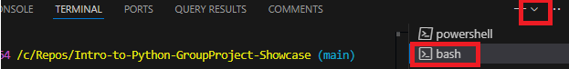
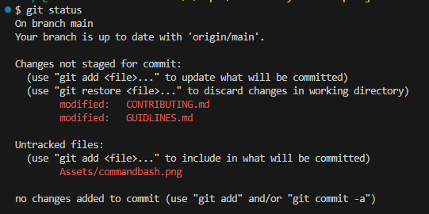

# Contributing
This document describes how your separate repository should setup on Github and how to create a submodule into ReDI's repository using VS Code, using your separate repository. For more information, refer to [GUIDLINES.md](GUIDLINES.md).

*Request ReDI School to be a contributor to this Repo if you haven't been invited yet. Otherwise, you cannot create a branch from ReDI's repo*

## ✅ Step 1: Setup Your Own Repository in GitHub (student repository)
Folder name is formated to this naming convention: (e.g, `2025-spring-hangmangame` )
    
    year-season-projectname

    
## 📁 Setup Your Project Folder
Each `project` folder should contain:
- `README.md`: brief description of the project
    - small intro, goals, features, conclusions
-  Source Code Files: `.py`, `.js`, `.jpynb`, `.html` `.txt` etc...
- Asset folder (optional)
    - images

*When your repo is complete, you are ready to move onto ReDI's Repo to do the next steps*

## ✅ Step 2: Clone ReDI School's Main Repository in VS Code Terminal
On GitHub, click `<> Code` to copy the URL 

*Hint
: https://github.com/ReDI-Aarhus/GroupProject-Showcase.git*

On VS Code, open the Terminal and select the arrow to switch to Git Bash:

In the Terminal write the following `bash command`:

    $ git clone https://github.com/ReDI-Aarhus/GroupProject-Showcase.git

## ✅ Step 3: Create a Branch from ReDI's Repo

In the same Terminal create a branch from `main` (e.g., `2025-spring-hangmangame-steph`):

    $ git checkout -b "year-season-projectname-yourname"
    $ git push -u origin year-season-projectname-yourname

## ✅ Step 4: Check your branch on GitHub
On GitHub, located on the near the top of ReDI's repository page, click the `Branches` tab to confirm that your branch is in ReDI's repository

## ✅ Step 5: Add Submodules in Your Branch

Run the following bash command to add the submodule:

    git submodule add <repo-url> Projects/yourrepofoldername

*Hint*
- Copy *your repo-url* into the following command (e.g, `https://github.com/StephSegaW/HangmanGroupProject.git`)
- specify to your course in the Projects folder

Example

    git submodule add https://github.com/yourusername/repoproject Into-to-Python/Projects/HangmanGroupProject

After adding the submodule, Git creates a special file called `.gitmodules` and adds a reference to each submodule.

Write the following commands in bash to stage and commit your work

    git add .gitmodules Projects/yourrepofoldername
    git commit -m "Add submodule projectname"
    git add .gitmodules projects/yourrepofoldername
    git commit -m "Add submodule projectname"

Then push:

    git push -u origin nameofyourbranch

## ✅ Step 7: Create a Pull Request from GitHub
Go back to ReDI's Repo : https://github.com/ReDI-Aarhus/GroupProject-Showcase.git

GitHub will usually detect your new branch and show a prompt:

Select the prompt. `Compare & pull request`

**OR MANUALLY:**

Select the `Pull Requests` tab at the top of the ReDI Repo on Github

Select `New pull request`

Under base, choose `main`

Under compare, choose `your branch`

Fill in:

    Title of your choice

    Description of what you did

Select `Create pull request`

## ✅ Step 8: Notify ReDI
Via Slack, send ReDI a message to Kat to accept your pull request and include the name or your branch.

# 📌 Extra Best Practices

## 🔄 Pulling updates from Main to Your Branch
Check your branches status compared to main

    git status
    
This fetches changes from the remote main branch and updates your branch

    git pull origin main
Push the updates to your branch

    git push -u origin your-branch-name

## 🔄 Saving Changes in Your Branch
You may want to update your repository. You should save your work, stage it (add) and then commit (commit -m). Be sure to push your commit to your branch again after.

### ✅ Step 1: Save your changes
Always `SAVE` your changes in the file you modified. 

### ✅ Step 2: Stage and Commit your changes
Remember filenames are case sensitive. You can add multiple files when necessary.

    git add filename
    git commit -m "describe what you changed"

### ✅ Step 3: Push your commits to your branch
    git push -u origin nameofyourbranch

### ✅ Step 4: Check your branch it is up to date
Use the following to double check your last commit history and the status of your branch. You can use it before your start and after your push your work. Read the output carefully

    git status
    git log

The status Terminal output could look like this example (below). This example indicates that CONTRIBUTING.md, GUIDLINES.md have been modified, but they are not staged yet. Also, Assets/commandbash.png is also not staged yet. It will be up to you should you need to stage and commit those changes. 

*If you are unsure what to do at any stage, please contact Kat to connect you with someone who can support you.*
