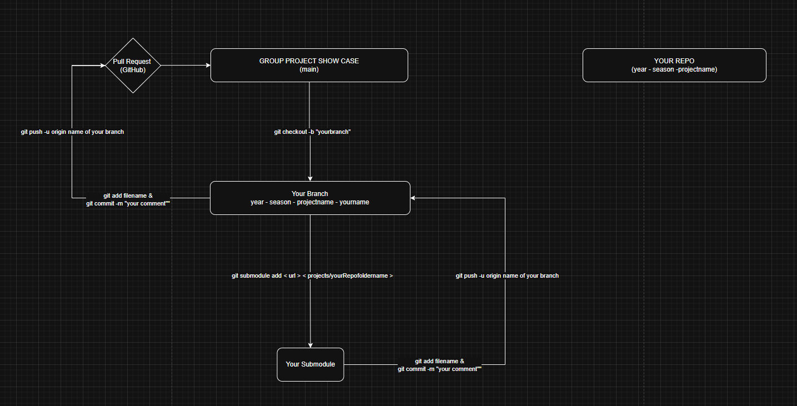

## Folder Structure Example

    Group-Project-Showcase/
    ├── .gitmodules
    ├── README.md
    ├── CONTRIBUTING.md
    ├── Courses
        ├── Intro-to-Python
            └── projects/
                ├── GroupProject1/ (submodule)
                ├── GroupProject2/ (submodule)
                └── GroupProject3/ (submodule)
        ├── Data-Analytics
        ├── Intro-to-JavaScript
        ├── Advanced-JavaScript
        ├── UX-UI-Design
        ├── Intro-to-Cybersecurity

> **Note:** A [Git submodule](https://git-scm.com/book/en/v2/Git-Tools-Submodules) is a repository embedded inside another repository. In this structure, each group project is added as a submodule, allowing you to keep your project code separate while linking it to the main showcase repository.

## Naming Convention:
- Project Folder (inside the student repository):
    - year-season-projectname

- Branch Name (inside ReDI repository):
    - year-season-projectname-yourname

    
## Logic Flow

This diagram shows the general structure and workflow for organising group projects in Git and GitHub. ReDI School maintains the `main repository`, while each student or group has their own *separate* project repository on GitHub.

1. Student creates their group's separate repo on GitHub
2. They clone the ReDI School's repository to their computer using VS Code.
3. They create a new branch in the school repository for their project.
4. Inside their branch, the student **adds their own project as a submodule**, linking ReDI to their GitHub repo. 
5. When the branch is ready, they **push their branch to GitHub** and **create a pull request**
6. ReDI School reviews the pull request and, if everything looks good, **merges it into the main branch.**
